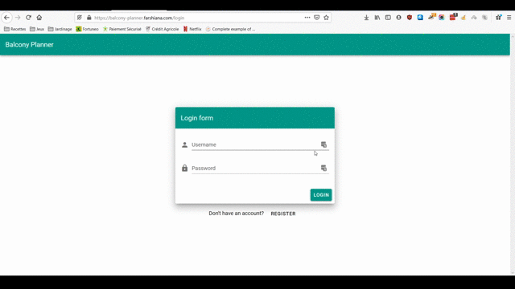

# balcony-planner-api

## Demo


Wanna try the app? It's [right here](https://balcony-planner.farshiana.com)!

The [API](https://balcony-planner-api.farshiana.com) and its [documentation](https://balcony-planner-api.farshiana.com/api-docs) are also available.

## Technologies
* Node.js with Express
* PostgreSQL with Sequelize
* Authentication with express-session
* Validation with Joi
* Documentation with Swagger
* Testing with Jest and Supertest
* Linter with ESLint
* File upload with AWS SDK
* Error tracking with Sentry
* Hosted with AWS (EC2, RDS, Route53)
* CI/CD with CircleCI
* Automated restart with PM2

## Project setup
### Installs dependencies
```
yarn install
```

### Compiles and hot-reloads for development
```
yarn dev
```

### Compiles and runs for production
```
yarn start
```

### Runs unit tests
```
yarn test
```

### Lints and fixes files
```
yarn lint
```

### Database
For test and development environments, create the databases using the settings in db.config.js
For the production database, create it and fill the information in the .env file as explained below.
Run the migration scripts in package.json for each environments to run the migrations that will create the tables.

### Environment variables
Simply copy the .env.sample file in a new .env file

## Next steps
Obviously, the whole app has already taken quite some time.
However, there are still lots of things to improve. For example:
* The database must be secured
* The API should monitored (StatsD, Grafana)
* The CI/CD must be improved with a Github Action
